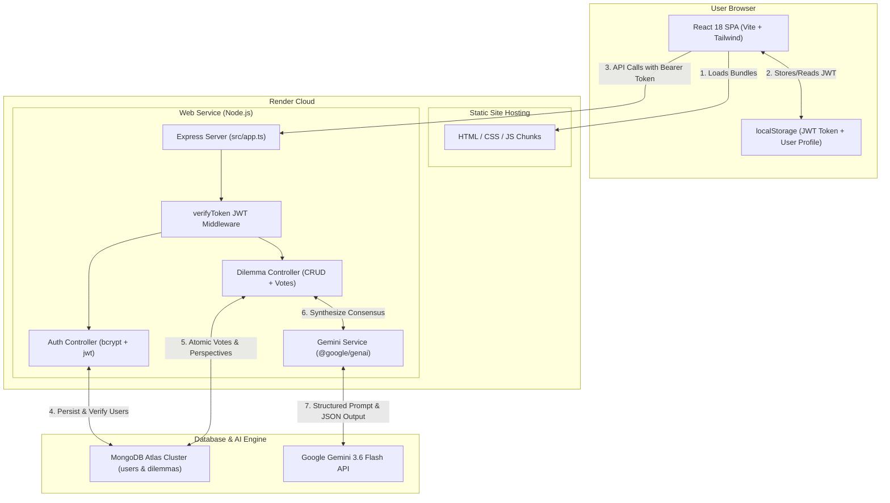

# CrowdWise — Collective Decision & Deliberation Platform

[](https://crowdwise-6eeq.onrender.com/)
[](https://crowdwisebackend3.onrender.com/health)
[](https://www.typescriptlang.org/)
[](https://react.dev/)
[](https://www.mongodb.com/)
[](https://ai.google.dev/)

**CrowdWise** is an executive-grade collective decision intelligence platform. It empowers leaders, engineers, and teams to resolve complex dilemmas by gathering real-time community votes and structured perspectives, synthesized into authoritative insights via **Google Gemini 3.6 Flash**.

---

## 🌐 Live Deployments

| Component | URL | Status | Description |
|---|---|---|---|
| **Web Client (Frontend)** | [https://crowdwise-6eeq.onrender.com/](https://crowdwise-6eeq.onrender.com/) | 🟢 Active | React 18 + Vite + Tailwind CSS SPA |
| **API Server (Backend)** | [https://crowdwisebackend3.onrender.com/](https://crowdwisebackend3.onrender.com/) | 🟢 Active | Express + TypeScript REST API |
| **Health Check** | [https://crowdwisebackend3.onrender.com/health](https://crowdwisebackend3.onrender.com/health) | 🟢 Active | `{"status":"healthy"}` |

---

## 🧠 System Architecture & Workflow



---

## 📂 Deep Dive: Project Structure & File Map

Understanding how files in this repository interact is key to learning modern full-stack development.

```
crowdwise/
├── client/                     # Frontend Application (React + Vite + TypeScript)
│   ├── src/
│   │   ├── components/         # Modular UI Views & Components
│   │   │   ├── Header.tsx                 # Top navigation, active tabs, profile trigger
│   │   │   ├── ExploreView.tsx            # Community feed, search bar, category chips
│   │   │   ├── CategoriesView.tsx         # Category grid with dilemma counters
│   │   │   ├── MyDilemmasView.tsx         # Dashboard for authenticated user's dilemmas
│   │   │   ├── DilemmaCard.tsx            # Single-column focal deliberation card
│   │   │   ├── VotingPills.tsx            # Interactive A/B decision pills with progress bars
│   │   │   ├── AIConsensus.tsx            # Gemini 3.6 Flash synthesis card with confidence rating
│   │   │   ├── CommunityPerspectives.tsx  # Threaded debate comments by leaning (A vs B)
│   │   │   ├── NewDilemmaModal.tsx        # Modal form to create & publish new dilemmas
│   │   │   └── ProfileModal.tsx           # JWT Sign In, Sign Up, and account management
│   │   ├── services/
│   │   │   └── api.ts                     # Centralized API client with JWT token interceptors
│   │   ├── App.tsx                        # Main application controller, tab & modal router
│   │   ├── main.tsx                       # React DOM root mounting
│   │   ├── index.css                      # Global styles and Tailwind directives
│   │   └── vite-env.d.ts                  # Vite client environment variable type definitions
│   ├── tailwind.config.js                 # Design tokens (Apple/Stitch palette, typography, shadows)
│   ├── tsconfig.json                      # Frontend TypeScript configuration
│   ├── package.json                       # Frontend dependencies & scripts
│   └── .env.example                       # Frontend environment template
│
├── server/                     # Backend Application (Node.js + Express + TypeScript)
│   ├── src/
│   │   ├── config/
│   │   │   └── db.ts                      # MongoDB Atlas Mongoose connection & resilience
│   │   ├── controllers/
│   │   │   ├── authController.ts          # Sign Up, Sign In, password hashing & JWT issuance
│   │   │   └── dilemmaController.ts       # Dilemmas CRUD, atomic voting, comments & AI synthesis
│   │   ├── middlewares/
│   │   │   └── auth.ts                    # JWT token extraction & authentication guard
│   │   ├── models/
│   │   │   ├── User.ts                    # User schema with pre-save bcrypt password hashing
│   │   │   └── Dilemma.ts                 # Dilemma schema with options, votes, comments & AI cache
│   │   ├── routes/
│   │   │   ├── authRoutes.ts              # Authentication routes (/api/auth/login, /api/auth/register)
│   │   │   └── dilemmaRoutes.ts           # Dilemma routes (/api/dilemmas, /vote, /comments, etc.)
│   │   ├── services/
│   │   │   └── geminiService.ts           # Google Gemini 3.6 Flash integration via @google/genai
│   │   ├── app.ts                         # Express app configuration, security & middlewares
│   │   └── server.ts                      # Server entry point, port binding (0.0.0.0 for cloud)
│   ├── tests/
│   │   └── verify.ts                      # Automated verification test script
│   ├── tsconfig.json                      # Backend TypeScript configuration
│   ├── package.json                       # Backend dependencies & production build scripts
│   └── .env.example                       # Backend environment template
│
├── .gitignore                             # Secret & build hygiene (.env, dist/, node_modules/)
└── README.md                              # Project documentation & architectural guide
```

---

## 🔗 How Components & Files Connect (The Data Journey)

### 1. The Authentication Pipeline (`JWT` & `BcryptJS`)
- **UI Trigger**: The user clicks the profile avatar in [`Header.tsx`](client/src/components/Header.tsx), opening [`ProfileModal.tsx`](client/src/components/ProfileModal.tsx).
- **Client Request**: [`api.ts`](client/src/services/api.ts) sends `POST /api/auth/login` or `POST /api/auth/register`.
- **Backend Controller**: [`authController.ts`](server/src/controllers/authController.ts):
  - For registration: Salting and hashing passwords via `bcryptjs` before persisting into MongoDB through [`User.ts`](server/src/models/User.ts).
  - For login: Compares provided plaintext password against the hash using `bcrypt.compare`.
  - On success, signs a JSON Web Token (JWT) with `JWT_SECRET` and returns it.
- **Client Persistence**: [`api.ts`](client/src/services/api.ts) stores `crowdwise_token` and user details in `localStorage`. All subsequent requests automatically append the header:
  ```http
  Authorization: Bearer <token>
  ```
- **Protection**: Protected routes (like posting new dilemmas) pass through [`middlewares/auth.ts`](server/src/middlewares/auth.ts), which validates the signature and decodes user info into `req.user`.

---

### 2. The Deliberation & Voting Flow
- **Fetching Feed**: When [`App.tsx`](client/src/App.tsx) loads, [`ExploreView.tsx`](client/src/components/ExploreView.tsx) invokes `getDilemmas()` from [`api.ts`](client/src/services/api.ts), hitting `GET /api/dilemmas`.
- **Displaying Focal Dilemma**: Selecting any dilemma loads [`DilemmaCard.tsx`](client/src/components/DilemmaCard.tsx).
- **Casting a Vote**:
  - The user selects Option A or Option B in [`VotingPills.tsx`](client/src/components/VotingPills.tsx).
  - The client dispatches `POST /api/dilemmas/:id/vote` with `{ option: "A" }`.
  - In [`dilemmaController.ts`](server/src/controllers/dilemmaController.ts), MongoDB performs an atomic update:
    ```typescript
    await Dilemma.findByIdAndUpdate(id, {
      $inc: { "options.0.votes": 1, totalVotes: 1 },
      $addToSet: { "options.0.voterIds": userId }
    });
    ```
  - The client receives the updated vote tallies and smoothly recalculates percentage progress bars in real-time.

---

### 3. The Gemini 3.6 Flash Consensus Engine
- **How it Works**:
  - Located in [`geminiService.ts`](server/src/services/geminiService.ts), using `@google/genai`.
  - Takes the dilemma title, context, current vote distribution, and user community perspectives.
  - Passes a prompt instructing Gemini to analyze trade-offs, consensus divergence, and strategic direction.
- **Trigger Points**:
  - **On Creation**: When publishing a new dilemma via [`NewDilemmaModal.tsx`](client/src/components/NewDilemmaModal.tsx), if no manual insights are supplied, Gemini automatically generates the initial synthesis.
  - **On Demand**: Users can click the **Refresh Gemini Synthesis** button inside [`AIConsensus.tsx`](client/src/components/AIConsensus.tsx) anytime new votes or perspectives are submitted.
  - **Live Endpoint**: Dispatches `POST /api/dilemmas/:id/ai-consensus`, computes fresh insights, persists them to MongoDB, and updates the client UI.

---

## 🛠️ API Reference

### Auth Endpoints (`/api/auth`)
| Method | Endpoint | Auth Required | Description |
|---|---|:---:|---|
| `POST` | `/api/auth/register` | No | Creates a new user account with hashed password |
| `POST` | `/api/auth/login` | No | Authenticates credentials and returns a signed JWT |
| `GET` | `/api/auth/me` | Yes | Retrieves current user profile from token |

### Dilemma Endpoints (`/api/dilemmas`)
| Method | Endpoint | Auth Required | Description |
|---|---|:---:|---|
| `GET` | `/api/dilemmas` | No | Paginated list of dilemmas with search and category filters |
| `GET` | `/api/dilemmas/:id` | No | Detailed view of a single dilemma |
| `POST` | `/api/dilemmas` | Optional* | Creates a new dilemma (*anonymous allowed with fallback user) |
| `POST` | `/api/dilemmas/:id/vote` | No | Casts vote for Option A or B and returns new percentages |
| `POST` | `/api/dilemmas/:id/comments`| No | Submits a structured community perspective |
| `POST` | `/api/dilemmas/:id/ai-consensus`| No | Re-evaluates dilemma with Google Gemini 3.6 Flash |

---

## ⚙️ Environment Variables

### Backend Configuration (`server/.env`)
```bash
PORT=5001
MONGODB_URI=mongodb+srv://<username>:<password>@cluster0.d89cyp9.mongodb.net/crowdwise?retryWrites=true&w=majority&appName=Cluster0&authSource=admin
JWT_SECRET=supersecretjwtkey_crowdwise_2026_change_in_production
JWT_EXPIRES_IN=7d
NODE_ENV=production
GEMINI_API_KEY=your_google_gemini_api_key_here
```

### Frontend Configuration (`client/.env`)
```bash
# Set this to your live Render backend URL
VITE_API_URL=https://crowdwisebackend3.onrender.com
```

---

## 💻 Local Setup & Development Guide

If you want to run the entire stack locally:

### 1. Clone Repository
```bash
git clone https://github.com/Shubh-am13/DecisionFlow-updated.git
cd DecisionFlow-updated
```

### 2. Start Backend Server
```bash
cd server
npm install
cp .env.example .env
# Edit .env with your MongoDB Atlas connection string and Gemini API Key
npm run dev
# Server will start on http://localhost:5001
```

### 3. Start Frontend Client
```bash
cd ../client
npm install
cp .env.example .env
npm run dev
# Web application will start on http://localhost:5173
```

---

## 🚀 How This Project is Deployed on Render

1. **Backend Web Service (`crowdwisebackend3`)**:
   - **Root Directory**: `server`
   - **Build Command**: `npm install && npm run build`
   - **Start Command**: `npm start`
   - **Environment Variables**: `MONGODB_URI`, `JWT_SECRET`, `JWT_EXPIRES_IN`, `NODE_ENV=production`, `GEMINI_API_KEY`.
2. **Frontend Static Site (`crowdwise-6eeq`)**:
   - **Root Directory**: `client`
   - **Build Command**: `npm install && npm run build`
   - **Publish Directory**: `dist`
   - **Environment Variable**: `VITE_API_URL=https://crowdwisebackend3.onrender.com`
   - **Rewrite Rule**: `/*` → `/index.html` (for React SPA routing).

---

## 🛡️ Security Best Practices Implemented
- **Zero-Secret Commits**: All database passwords, tokens, and API keys are strictly loaded through environment variables and excluded via `.gitignore`.
- **Database Authentication**: MongoDB Atlas connection strings enforce `authSource=admin` for robust role-based authentication.
- **Password Hashing**: Uses 10 salt rounds with `bcryptjs`.
- **Stateless Tokens**: JWTs signed with expiration limits.
- **HTTP Hardening**: Configured with `helmet` headers and scoped `cors` rules.

---

## 👨‍💻 Author
**Shubham Sinha**  
GitHub: [@Shubh-am13](https://github.com/Shubh-am13)
